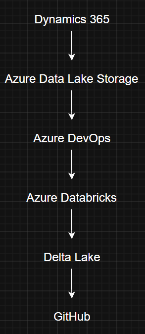
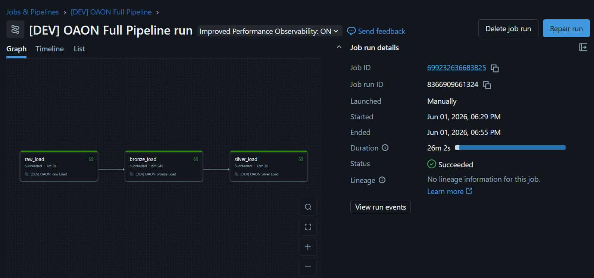
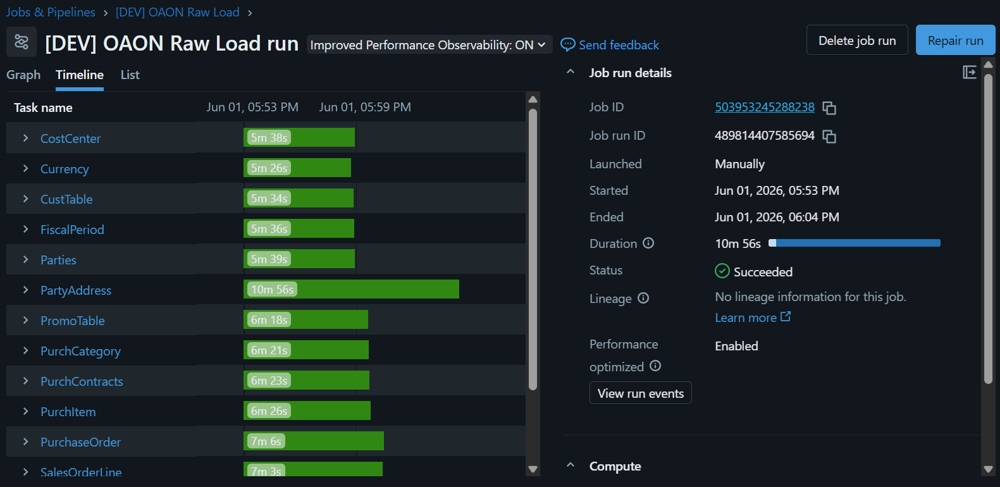
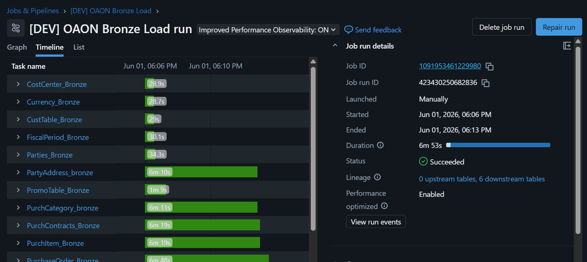
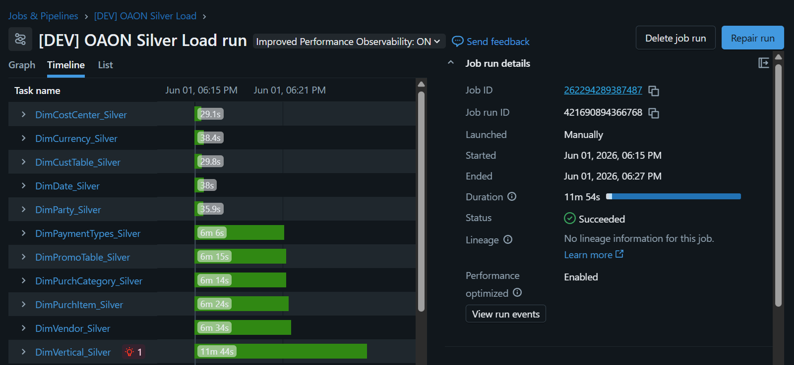
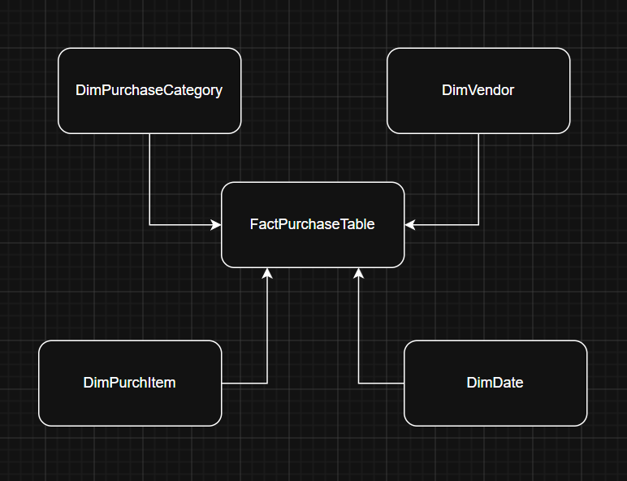

## Introduction 
Order Anything Online (OAON) is an end-to-end Data Engineering project that demonstrates the design and implementation of a modern Lakehouse architecture on Azure. The solution processes enterprise data from Microsoft Dynamics 365 across Purchasing, Sales, Human Resources, and Customer Support domains, applying Medallion Architecture principles to transform raw operational data into analytics-ready datasets. The project showcases practical experience with Azure Databricks, Delta Lake, Git-based development workflows, Databricks Asset Bundles, and data pipeline orchestration, following industry-standard Data Engineering practices.

## Solution Architecture

## Project Objectives
- Implement a Medallion Architecture using Databricks and Delta Lake.
- Process Microsoft Dynamics 365 CDM entities.
- Build scalable and maintainable ETL pipelines.
- Apply Git-based version control practices.
- Orchestrate workloads using Databricks Jobs and Asset Bundles.
- Deliver analytics-ready datasets for reporting and visualization.

## Tech Stack
| Technology               | Purpose                   |
| ------------------------ | ------------------------- |
| Azure Databricks         | Data Processing           |
| Delta Lake               | Storage Layer             |
| PySpark                  | Data Transformations      |
| GitHub                   | Version Control           |
| Databricks Asset Bundles | Infrastructure as Code    |
| Azure DevOps             | Task Management           |
| Microsoft Dynamics 365   | Source System             |

## Data Architecture
#### Raw Layer
Convert cdm format from Microsoft Dynamics 365 to delta files and stores them in ADLS.

#### Bronze Layer
Creation of delta tables in Catalog from delta files in ADLS

#### Silver Layer
Applies data standardization, schema enforcement, datetime ingestion, datetime modification and hash columns. Contains cleansed and business-ready dimensional and transactional datasets.

## Workflow Orchestration

## Data Model

## CI/CD and DevOps

The project follows Git-based development practices using feature branches, pull requests, and automated deployment workflows. Databricks Asset Bundles are used to define and version workflow resources as code.

## Key Learnings

- Implemented a Lakehouse architecture using Delta Lake.
- Designed scalable Medallion data pipelines.
- Managed workflow orchestration with Databricks Jobs.
- Applied Infrastructure as Code principles using Databricks Asset Bundles.
- Practiced Git-based collaboration and version control.

## Future Improvements

- Add Gold layer business marts.
- Implement automated data quality checks.
- Deploy using GitHub Actions.
- Add unit testing and monitoring.
